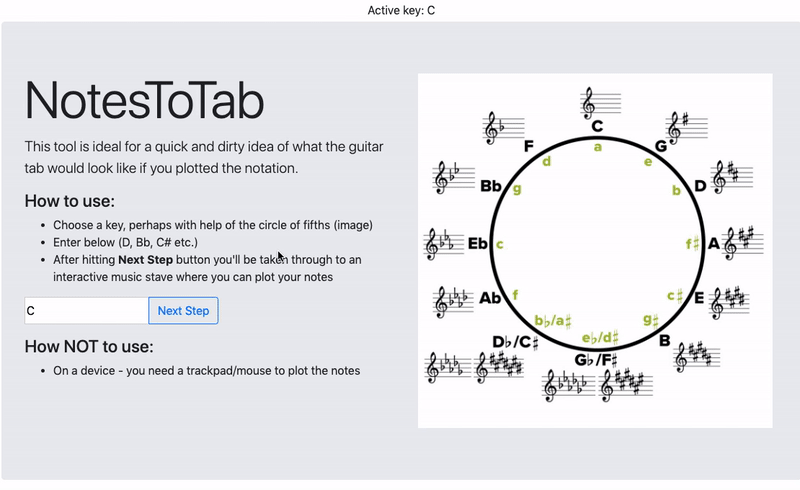

# Notate
www.notestotab.com

This app aims to provide an accurate tool for plotting notation and getting guitar tablature out in the browser.

## Running locally
Since it's just essentially an ejected `create-react-app` project, you can use:

`yarn && yarn start`

Go to localhost:3000

## Linting 
Eslint + prettier

`yarn lint`

## Testing
Enzyme, Jest and Cypress.

Unit: `yarn test`

Cypress: `yarn cypress:run`